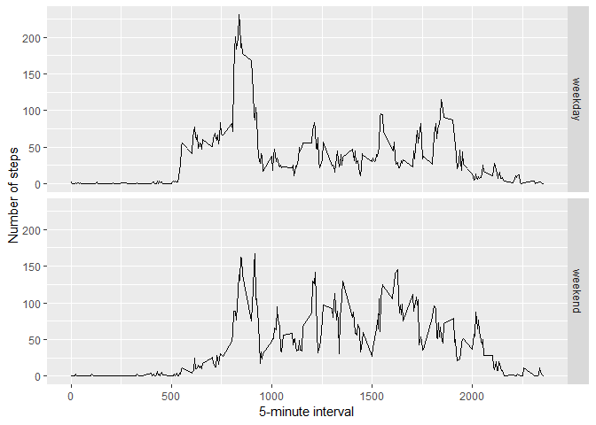

# Reproducible Research: Peer Assessment 1


## Loading and preprocessing the data
### Load data
#####Load necessary libraries, create a data folder, if it doesn't exist, download the specified file and load the activity CSV into a dataframe


```r
library(ggplot2)
```

```
## Warning: package 'ggplot2' was built under R version 3.4.4
```

```r
library(plyr)
```

```
## Warning: package 'plyr' was built under R version 3.4.4
```

```r
if(!file.exists("./data")){dir.create("./data")}
fURL <- "https://d396qusza40orc.cloudfront.net/repdata%2Fdata%2Factivity.zip"
download.file(fURL,destfile="./data/Dataset.zip",method="curl")
unzip(zipfile="./data/Dataset.zip",exdir="./data")
dfAct <- read.csv(file.path("./data/activity.csv"), header = TRUE)
```

### Process data
#####Add a day of the week, reformat the date/time, and remove measurements with no steps


```r
dfAct$day <- weekdays(as.Date(dfAct$date))
dfAct$DateTime<- as.POSIXct(dfAct$date, format="%Y-%m-%d")
```

## What is mean total number of steps taken per day?


```r
dfAgg <- aggregate(dfAct$steps ~ dfAct$date, FUN=sum, )
colnames(dfAgg)<- c("Date", "Steps")
```

### Histogram, Steps per day


```r
hist(dfAgg$Steps, breaks=5, xlab="Steps", main = "Total Steps per Day")
```

<!-- -->

### Mean steps per day: 

```r
myMean <- as.integer(mean(dfAgg$Steps))
print (paste0("Mean: ",myMean))
```

```
## [1] "Mean: 10766"
```
### MEDIAN: 

```r
myAvg <- as.integer(median(dfAgg$Steps))
print (paste0("Average: ",myAvg))
```

```
## [1] "Average: 10765"
```


## What is the mean and median daily activity pattern?

```r
##create average number of steps per interval (filter out measurements with null steps)
dfAct2 <- ddply(dfAct[!is.na(dfAct$steps),], .(interval), summarize, Avg = mean(steps))

##Create line plot of average number of steps per interval
p <- ggplot(dfAct2, aes(x=interval, y=Avg), xlab = "Interval", ylab="Average Number of Steps")
p + geom_line()+xlab("Interval")+ylab("Average Number of Steps")+ggtitle("Average Number of Steps per Interval")
```

<!-- -->

## Imputing missing values

```r
# Establish the number of NA steps measurements in the dataset
dfActComplete <- dfAct 
countNA <- nrow(dfActComplete[is.na(dfActComplete$steps),])
print (paste0("Number of NA steps in raw dataset: ",countNA))
```

```
## [1] "Number of NA steps in raw dataset: 2304"
```

```r
# Replace null steps with the average number of steps for the 5 second interval
for (i in 1:nrow(dfActComplete)) {
    if (is.na(dfActComplete$steps[i])) {
        dfActComplete$steps[i] <- dfAct2[which(dfActComplete$interval[i] == dfAct2$interval), ]$Avg
    }
}

# Evidence that NAs have been removed
countNA <- nrow(dfActComplete[is.na(dfActComplete$steps),])
print (paste0("Number of NA steps in completed dataset: ",countNA))
```

```
## [1] "Number of NA steps in completed dataset: 0"
```

## Are there differences in activity patterns between weekdays and weekends?

```r
fnDaytype <- function(date) {
    day <- weekdays(date)
    if (day %in% c("Monday", "Tuesday", "Wednesday", "Thursday", "Friday"))
        return("weekday")
    else if (day %in% c("Saturday", "Sunday"))
        return("weekend")
    else
        stop("invalid date")
}
dfActComplete$daytype <- sapply(dfActComplete$DateTime, FUN=fnDaytype)
```

Now, plot the average number of steps taken on weekdays and weekends to see what the differences are


```r
dfDayTypeAvg <- aggregate(steps ~ interval + daytype, data=dfActComplete, mean)
ggplot(dfDayTypeAvg, aes(interval, steps)) + geom_line() + facet_grid(daytype ~ .) +
    xlab("5-minute interval") + ylab("Number of steps")
```

<!-- -->
